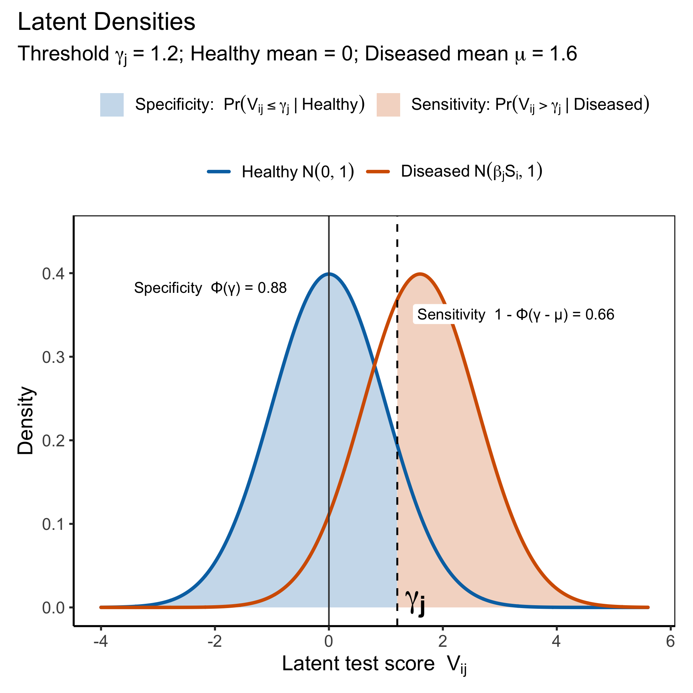
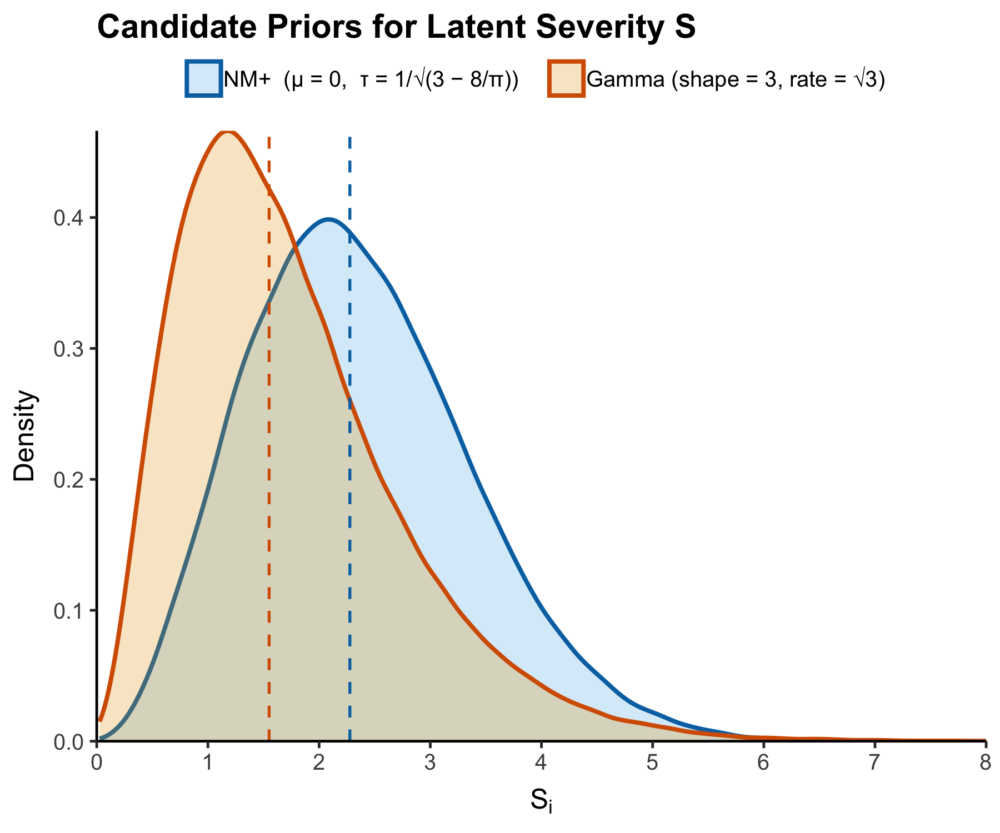

```{r setup, include=FALSE}
knitr::opts_chunk$set(
  echo = TRUE,
  message = FALSE,
  warning = FALSE,
  fig.path = "README_files/"
)
```


A **Bayesian latent class model with continuous severity** for diagnostic test evaluation.

This framework extends the classical Hui–Walter and random-effects latent class models by introducing a continuous *latent severity* parameter, \( S_i \), representing the strength or intensity of infection among diseased individuals.  
The approach enables reliable estimation of test accuracy and prevalence even with fewer than four diagnostic assays, overcoming traditional identifiability constraints in small-panel evaluations.

---

## Overview

Conventional latent class models assume *conditional independence* between binary tests given a latent disease indicator.  
The **Latent Severity LCA (S-LCA)** relaxes this assumption by incorporating within-class variation in disease expression:

\[
T_{ij}^* = \beta_j S_i + \gamma_j + \varepsilon_{ij}, 
\qquad T_{ij} = \mathbb{I}(T_{ij}^* > 0), \quad 
\varepsilon_{ij} \sim \mathcal{N}(0, 1)
\]

Here, \( S_i \) captures subject-level severity when \( D_i = 1 \), allowing tests to respond differently across mild and strong infections.  
This yields more realistic inference on sensitivity, specificity, and prevalence, particularly when residual dependence exists among assays.


## Latent Gaussian Representation

The latent Gaussian formulation provides an intuitive view of how the detection threshold \( \gamma_j \) separates test outcomes between healthy and diseased individuals:


<p align="center">
  
</p>

---

## Function: `bayesian_severity_LCA()`

A unified function implementing **three model configurations** for the latent severity term \( S_i \):

### 1. Conditional Independence (CI) Model  
A baseline model assuming no within-class variation in disease severity:  
\[
S_i = D_i \quad \text{(binary latent disease indicator only)}
\]
This reduces to the classical Hui–Walter framework, serving as a reference model for conditional independence diagnostics.

### 2. Gamma Severity Model  
\[
S_i \mid D_i = 1 \sim \mathrm{Gamma}(\alpha_S, \beta_S)
\]
Provides a flexible, right-skewed representation of disease severity.  
The shape parameters \( (\alpha_S, \beta_S) \) can be tuned to reflect expected heterogeneity or residual dependence between assays.

### 3. Normal Moment (NM⁺) Severity Model  
\[
p(S_i \mid D_i = 1) \propto S_i^2 
\exp\!\left[-\frac{(S_i - \mu_0)^2}{2\tau^2}\right],
\quad S_i > 0
\]
A nonlocal prior that discourages near-zero severity, promoting sharper separation between healthy and diseased classes.  
Defaults \( (\mu_0, \tau) = (0, 1.48495) \) yield unit variance for \( S_i \).

---

## Posterior Components

All models employ MCMC with truncated-normal data augmentation for the latent diagnostic variables, including updates for:

- Class indicators \( D_i \)  
- Test parameters \( (\beta_j, \gamma_j, \sigma_j^2) \)  
- Prevalence \( \rho \)  
- Severity priors (CI, Gamma, or NM⁺)

---

### Candidate Priors for Severity

The following figure compares the Gamma and NM+ priors for \( S_i \) when each has variance = 1:

<p align="center">
  
</p>

---

### Case Study: Strongyloides Data (Dendukuri & Joseph, 2001)

We replicate and extend the Strongyloides stercoralis dataset analyzed by (Dendukuri, Joseph 1995), originally consisting of three binary assays applied to a refugee population.
The CI model serves as a baseline, while the Gamma and NM⁺ severity models reveal residual dependence between tests that cannot be explained by conditional independence alone.

The posterior summaries below illustrate how the latent severity formulation provides improved fit and interpretable differences in estimated sensitivity and prevalence across models.

---

### Conditional Independence Diagnostics

To formally evaluate whether test outcomes are independent given disease status, we construct a Bayesian chi-square diagnostic, computed from posterior predictive samples of the latent class model.


