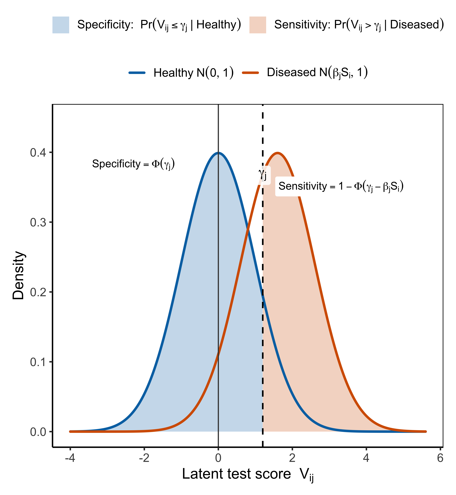
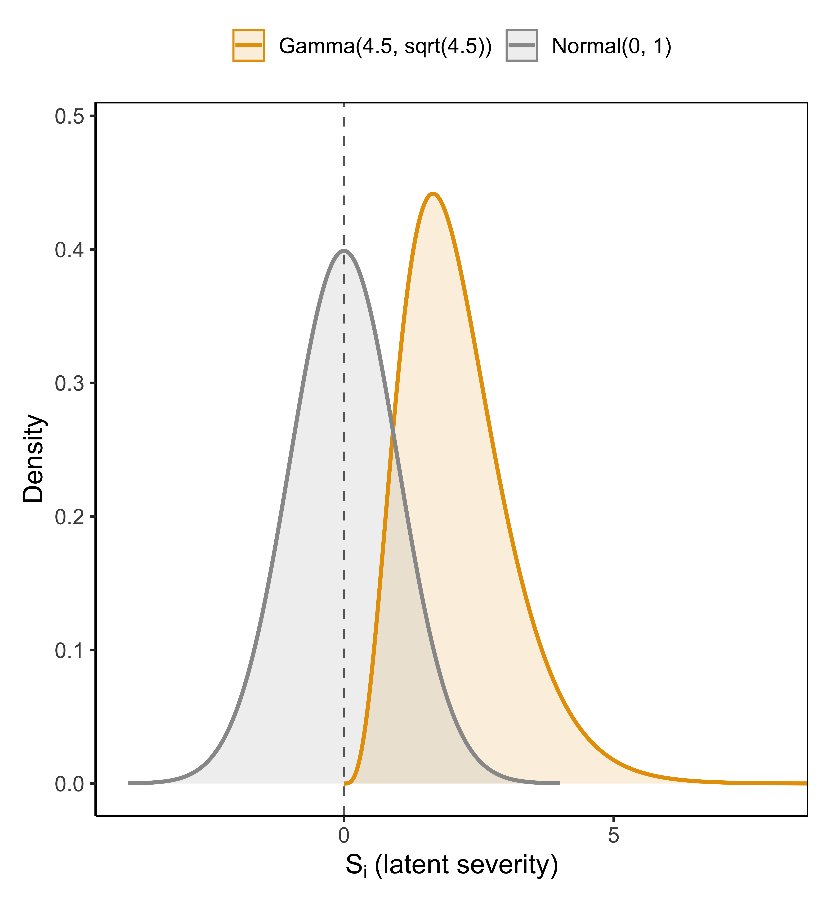

# Bayesian latent severity modeling for diagnostic test evaluation

Bayesian latent class models for binary diagnostic tests when no gold standard is available. The severity model adds one continuous subject-level factor among diseased individuals, so two imperfect assays can still inform prevalence, sensitivity, and specificity without a test-specific random effect for every class.

This repository accompanies the manuscript *Bayesian Latent Severity Modeling for Diagnostic Test Evaluation Without a Gold Standard*. It is a set of R scripts, not a package. Source `R/init.R` from the `R/` directory.

## Model

For subject $i$ and test $j$, the binary outcome is a thresholded latent score (Albert and Chib, 1993):

$$
T_{ij} = \mathbf{1}(V_{ij} > 0), \qquad
V_{ij} = \beta_j S_i D_i - \gamma_j + \varepsilon_{ij}, \qquad
\varepsilon_{ij} \sim N(0, 1).
$$

$D_i \in \{0,1\}$ is latent disease status, with prevalence $\rho = P(D_i = 1)$. Non-diseased subjects are anchored at $S_i = 0$, so $V_{ij} \mid D_i = 0 \sim N(-\gamma_j, 1)$. Diseased subjects have severity $S_i > 0$, and $\beta_j > 0$ is the assay-specific slope on that severity. The three roles stay separate: $\gamma_j$ sets specificity, $\beta_j$ scales the disease effect, and $S_i$ induces residual dependence among assays within the diseased class.

<p align="center">
  
</p>

Implied accuracy has a closed form only for specificity:

$$
\mathrm{Sp}_j = \Phi(\gamma_j), \qquad
\mathrm{Se}_j = \mathbb{E}_S\left[\Phi(\beta_j S - \gamma_j)\right].
$$

Sensitivity is the average of the probit probability over the severity distribution. In the sampler it is computed from the current diseased subjects; the population value is a Monte Carlo integral over $S$.

Only the product $\beta_j S_i$ enters the diseased mean, so severity and slope are not separately scaled. The severity variance is fixed at 1 to remove that ambiguity. In the manuscript,

$$
S_i \mid D_i = 1 \sim \mathrm{Gamma}(4.5,\sqrt{4.5})
$$

on the rate scale (mean $\sqrt{4.5}$, variance 1). The Gamma support on $(0,\infty)$ keeps diseased severity away from the non-diseased anchor at 0.

<p align="center">
  
</p>

### Two fitted models

`Bayesian_LCA_severity()` dispatches on `severity`.

| `severity` | Severity | Role |
|---|---|---|
| `"CI"` | $S_i = D_i$ | Probit conditional-independence model. Sensitivity is $\Phi(\beta_j - \gamma_j)$. |
| `"gamma"` | $S_i \mid D_i = 1 \sim \mathrm{Gamma}(a_S, b_S)$ | Severity model. Default in code is $a_S = 5$, $b_S = \sqrt{5}$; the manuscript uses $a_S = 4.5$, $b_S = \sqrt{4.5}$. Pass those explicitly. |

There is no Normal-moment severity option in this repository. The comparison random-effects model is separate: `bayes_2LCR()` in `R/bayes_2LCR.R` refits the Dendukuri and Joseph (2001) conditional-independence and probit random-effects models (`model = "CI"`, `"random"`, or `"2LCR1"`).

### Priors

Prevalence is $\rho \sim \mathrm{Beta}(a_\rho, b_\rho)$, default $\mathrm{Beta}(1,1)$.

Test priors are on the probit scale and are calibrated from elicited sensitivity and specificity ranges:

- $\gamma_j \sim N(\mu_{\gamma_j}, \sigma_{\gamma_j}^2)$, matched to the specificity interval through $\Phi(\gamma_j)$.
- $\beta_j \sim N^+(\mu_{\beta_j}, \sigma_{\beta_j}^2)$, truncated to $(0,\infty)$, chosen so the prior predictive distribution of $\Phi(\beta_j S - \gamma_j)$ matches the sensitivity interval.

`build_priors_from_ranges()` does that calibration. Exact matching is not always possible, because $\gamma_j$ enters both specificity and the diseased mean.

### Sampler

Both severity models use data augmentation for the latent scores and Gibbs updates for $\rho \mid D$. The Gamma model also updates $(D_i, S_i)$ with a joint Metropolis step, draws $V_{ij}$ from truncated normals, and slice-samples $\log S_i$ for diseased subjects. $\beta_j$ and $\gamma_j$ then have Gaussian full conditionals, with $\beta_j$ truncated at 0. The CI sampler uses an equivalent threshold parameterization and a random-walk update for $\beta_j$.

Returned objects use `rho_Samples`, `sensitivity_Samples`, `specificity_Samples`, `beta_Samples`, `gamma_Samples`, and `D_Samples`. The Gamma fit also returns `S_Samples`. `bayes_2LCR()` uses different names: `rho`, `sens`, `spec`.

## Layout

```
R/
  init.R                         # sources the scripts below
  Bayesian_severity_LCA.R        # Bayesian_LCA_severity()
  CI_LCA_probit.R                # conditional-independence sampler
  Gamma_LCA_severity.R           # Gamma severity sampler
  build_priors_from_ranges.R     # Se/Sp ranges to probit priors
  bayes_2LCR.R                   # Dendukuri–Joseph CI and random effects
  plot_prior_vs_posterior.R
  plot_prior_vs_posterior_2LCR.R
data/strongyloides/              # Joseph et al. (1995) reconstruction and fits
simulate_simple.R                # parameter-recovery runs
figures/                         # latent-score and severity-prior figures
```

## Use

From `R/`:

```r
source("init.R")
library(truncnorm)

# Joseph, Gyorkos, and Coupal (1995): stool (T1), serology (T2), N = 239
# both negative 112, stool only 2, serology only 87, both positive 38
patterns <- c("00", "10", "01", "11")
freq     <- c(112, 2, 87, 38)
data <- do.call(rbind, strsplit(rep(patterns, freq), ""))
data <- apply(data, 2, as.numeric)

ranges <- list(
  list(sens = c(0.07, 0.47), spec = c(0.89, 0.99)),  # stool
  list(sens = c(0.63, 0.92), spec = c(0.31, 0.96))   # serology
)

pr <- build_priors_from_ranges(ranges, severity = "gamma",
                               aS = 4.5, bS = sqrt(4.5))

fit <- Bayesian_LCA_severity(
  data       = data,
  iterations = 5000,
  burnin     = 1000,
  thin       = 5,
  severity   = "gamma",
  mu_beta    = pr$mu_beta,
  sd_beta    = pr$sd_beta,
  mu_gamma   = pr$mu_gamma,
  sd_gamma   = pr$sd_gamma,
  aS         = 4.5,
  bS         = sqrt(4.5),
  rho_beta   = c(1, 1)
)

quantile(fit$rho_Samples, c(0.025, 0.5, 0.975))
```

The manuscript fits use 500,000 iterations and 200,000 burn-in. The call above is only a smoke test.

`simulate_simple.R` generates CI and Gamma panels ($N = 4000$, $J = 4$, $\rho = 0.35$). That is not the two-test design in the manuscript. It also sources `~/Desktop/Bayesian-latent-severity-LCA/R/init.R`.

## Strongyloides

The published Joseph, Gyorkos, and Coupal (1995) table has 239 subjects: 112 negative on both tests, 2 stool only, 87 serology only, 38 positive on both. The call above builds that table. `data/strongyloides/Strongyloides_data.R` still expands `c(38, 2, 87, 35)` and sources a Desktop path. Do not use it to reproduce the manuscript until both are fixed.

Dendukuri and Joseph (2001) fit a conditional-independence model and a shared random effect to the same table. The manuscript refits those, then fits the probit conditional-independence model and the Gamma severity model. Under the elicited ranges, severity prevalence tracks the random-effect fit. Under ranges `[0.01, 0.999]`, the probit models contract and the Beta and random-effect fits do not.

The class-specific Pearson statistic is implemented in `R/Bayesian_CI_Test.R` as `Bayesian_CI_Test()`. It is not sourced by `R/init.R`, and no script calls it, so the manuscript check has not been run from this repo.

## References

Albert, J. H. and Chib, S. (1993). Bayesian analysis of binary and polychotomous response data. *Journal of the American Statistical Association* 88, 669–679.

Dendukuri, N. and Joseph, L. (2001). Bayesian approaches to modeling the conditional dependence between multiple diagnostic tests. *Biometrics* 57, 158–167.

Hui, S. L. and Walter, S. D. (1980). Estimating the error rates of diagnostic tests. *Biometrics* 36, 167–171.

Johnson, V. E. (2004). A Bayesian $\chi^2$ test for goodness-of-fit. *The Annals of Statistics* 32, 2361–2384.

Johnson, V. E. (2007). Bayesian model assessment using pivotal quantities. *Bayesian Analysis* 2, 719–733.

Joseph, L., Gyorkos, T. W., and Coupal, L. (1995). Bayesian estimation of disease prevalence and the parameters of diagnostic tests in the absence of a gold standard. *American Journal of Epidemiology* 141, 263–272.

Qu, Y., Tan, M., and Kutner, M. H. (1996). Random effects models in latent class analysis for evaluating accuracy of diagnostic tests. *Biometrics* 52, 797–810.
